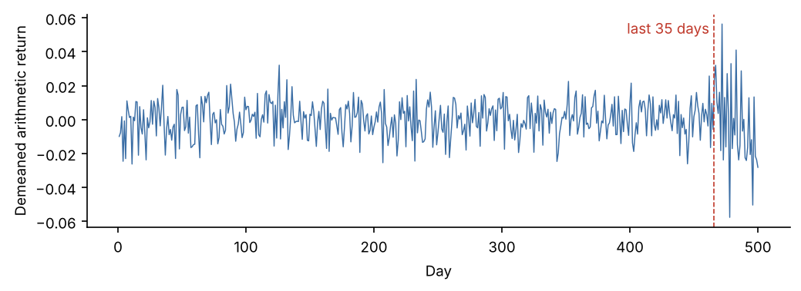
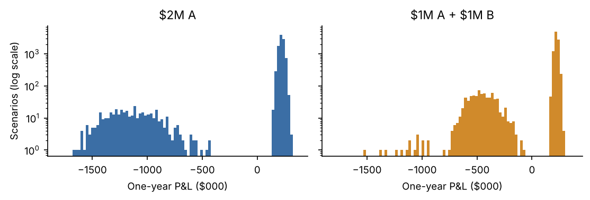
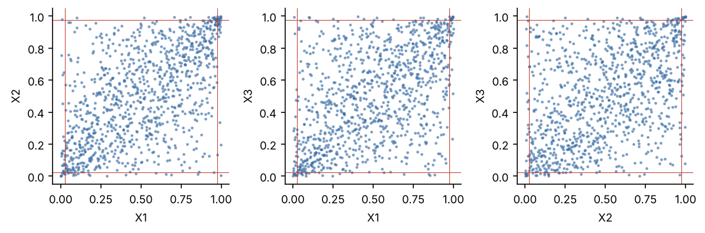
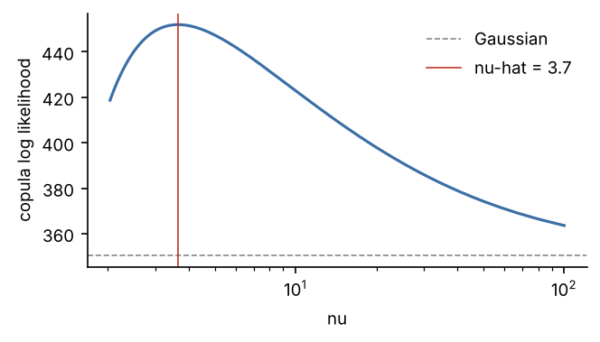

Conventions used throughout: arithmetic returns; VaR and ES at $\alpha=5\%$ unless stated, positive
numbers are losses, absolute (not mean-relative) convention; historical quantile = the
$\lceil n\alpha\rceil$-th worst value; variance with $n-1$; skew and **excess** kurtosis bias-corrected.
All simulations use 100,000 draws and seed 545. Code: the `qrm` Python library plus one script per
problem (see README).

# Correlations from Mismatched Histories

## Predict

Days jointly observed (diagonal = days each series trades). **All five trade on 81 days.**

|  | A | B | C | D | IDX |
|:---|---:|---:|---:|---:|---:|
| A | 242 | 242 | 221 | 93 | 242 |
| B | 242 | 242 | 221 | 93 | 242 |
| C | 221 | 221 | 228 | 83 | 228 |
| D | 93 | 93 | 83 | 96 | 96 |
| IDX | 242 | 242 | 228 | 96 | 250 |

**(a)** Complete case is guaranteed PSD: it is an ordinary sample correlation matrix of one common
data matrix, i.e. a Gram matrix, so $w'Cw$ is the sample variance of a real portfolio and cannot be
negative. Pairwise can fail: each entry is estimated on a different set of days, so the entries need not be
mutually consistent with any single joint distribution.

**(b)** If IDX were an exact linear combination the true matrix would be singular (smallest eigenvalue 0).
With only a small tracking error, the smallest true eigenvalue is just above 0. There is no buffer, so the
small inconsistencies created by pairwise estimation are enough to push it below zero. This data set is
highly exposed.

**(c)** The pairs involving D (93–96 days, C–D only 83), because the standard error of $\hat\rho$ is
roughly $(1-\rho^2)/\sqrt n$: about 0.10 at $n\approx 90$ against 0.06 at $n\approx 240$. D's
correlations are also measured on a different (later) window than everything else.

## Fit

**(d)**

|  | $\lambda_1$ | $\lambda_2$ | $\lambda_3$ | $\lambda_4$ | $\lambda_5$ | Cholesky |
|:---|---:|---:|---:|---:|---:|---:|
| Complete case | 0.0015 | 0.5483 | 0.6933 | 0.8704 | 2.8864 | succeeds |
| Pairwise | -0.0111 | 0.4714 | 0.5284 | 0.8574 | 3.1539 | **fails** |

Complete case (81 days):

|  | A | B | C | D | IDX |
|:---|---:|---:|---:|---:|---:|
| A | 1.0000 | 0.3967 | 0.2466 | 0.4136 | 0.8714 |
| B | 0.3967 | 1.0000 | 0.3169 | 0.2361 | 0.6709 |
| C | 0.2466 | 0.3169 | 1.0000 | 0.1852 | 0.5648 |
| D | 0.4136 | 0.2361 | 0.1852 | 1.0000 | 0.5719 |
| IDX | 0.8714 | 0.6709 | 0.5648 | 0.5719 | 1.0000 |

Pairwise:

|  | A | B | C | D | IDX |
|:---|---:|---:|---:|---:|---:|
| A | 1.0000 | 0.4686 | 0.4309 | 0.4384 | 0.8696 |
| B | 0.4686 | 1.0000 | 0.4630 | 0.2767 | 0.7329 |
| C | 0.4309 | 0.4630 | 1.0000 | 0.1846 | 0.7136 |
| D | 0.4384 | 0.2767 | 0.1846 | 1.0000 | 0.6057 |
| IDX | 0.8696 | 0.7329 | 0.7136 | 0.6057 | 1.0000 |

**(e)** With $\Sigma = DCD$ (pairwise $C$, full-history $\sigma$), the portfolio
$w = (-0.4, -0.3, -0.2, -0.1, +1)$ on (A, B, C, D, IDX) has
$w'\Sigma w =$ **$-1.80 \times 10^{-6}$**: a **negative variance**. (For reference, the realised variance of the
tracking residual on the 81 complete days is $3.22 \times 10^{-7}$.)

**(f)**

| Repair | Smallest eigenvalue | Frobenius distance from pairwise | Tracking variance |
|:---|---:|---:|---:|
| Rebonato–Jäckel | $3.59 \times 10^{-17}$ | 0.0162 | $6.81 \times 10^{-7}$ |
| Higham | $-2.11 \times 10^{-13}$ (≈0, float) | 0.0155 | $6.79 \times 10^{-7}$ |

Both repaired matrices pass Cholesky.

## Reconcile

**(g)** $w'\Sigma w$ is the variance of portfolio $w$; PSD means it is $\ge 0$ for every $w$. Finding a $w$
with $w'\Sigma w<0$ is a direct proof the matrix is not PSD. It is not a random $w$: the eigenvector of
the negative eigenvalue has cosine similarity **0.997** with the tracking portfolio (in correlation units).
The one portfolio the data says is nearly riskless is exactly the direction that went negative.

**(h)** Higham moved the **IDX row** most (IDX–A -0.0070, IDX–C -0.0048,
IDX–B -0.0042); D's entries moved only about 0.002. That is *not* my answer to (c).
The repair knows nothing about sample sizes. It uses only geometry: the negative eigenvalue's eigenvector
(loading 0.82 on IDX) and the nearest point in Frobenius norm, so it changes the entries that
most cheaply remove that direction. Sample-size information would need a weighted Higham norm.

**(i)** Repair distance ≈ 0.016 against an estimator gap
$\|C_{cc}-C_{pw}\|_F$ = **0.424**, about 27× larger.
The two repairs give almost the same tracking variance ($6.81 \times 10^{-7}$ vs
$6.79 \times 10^{-7}$), while complete case gives $1.10 \times 10^{-6}$. **The choice of estimator
matters far more than the choice of repair.**

# A Volatility Estimate After the Regime Changed

## Predict

{width=88%}

**(a)** Predicted order, smallest to largest: **Student t ≈ Normal equal-weight < Historical < Normal EW 0.97 <
Normal EW 0.94.** The equal-weight methods give the last 35 high-volatility days only
7% of the weight. Historical takes the 25th-worst of 500 days, and the storm
days supply many of the worst ones, so it should sit a little above. The fitted t matches the overall
variance with fatter tails, so its 5% quantile should be near (or inside) the normal one. The EW estimators
put most of their weight on the storm; 0.94 more than 0.97.

**(b)**

| λ | $n_{eff}$ | Half life (days) | Weight on last 35 days |
|:---|---:|---:|---:|
| 0.94 | 32.3 | 11.2 | 88.5% |
| 0.97 | 65.7 | 22.8 | 65.6% |
| Equal | 500 | – | 7.0% |

**(c)** Mean 0 (demeaned), sd 1.191%, skew -0.156, excess kurtosis
**2.17** (Jarque–Bera p ≈ 1e-21). A single normal regime gives excess kurtosis ≈ 0, so
I predict it could **not** produce these moments.

## Fit

**(d)**

| Method | One-day 5% VaR |
|:---|---:|
| Normal, equal weight | \$19,594 |
| Normal, EW 0.97 | \$34,619 |
| Normal, EW 0.94 | \$38,707 |
| Student t MLE | \$18,872 |
| Historical | \$20,574 |

Fitted t: $\nu$ = 8.27, $\mu$ = 0.00018, scale $s$ = 0.01029
(implied sd 1.182%).

## Reconcile

**(e)** Realised order: Student t MLE < Normal, equal weight < Historical < Normal, EW 0.97 < Normal, EW 0.94. This matches the prediction. The only point worth noting is
that the t sits *below* the equal-weight normal: at the same variance a fat-tailed distribution has more mass
in the centre and the far tail, so its 5% point is slightly inside the normal's.

**(f)** sd before the break = **1.024%**, last 35 days = **2.535%**
(2.5×). Inside each regime the excess kurtosis is ≈ 0 (-0.19 and
-0.08). A mixture of two zero-mean normals with these weights and variances has
excess kurtosis 2.79, close to the 2.17 observed. The fat tails are the
**mixing of two regimes**, not fat tails within either one. The fitted t is a scale mixture of normals, so it is
describing the *unconditional* blend of both regimes (implied sd 1.18%), not today's
2.5% volatility.

**(g)** Standard error of the VaR from $\sigma/\sqrt{2n_{eff}}$: \$4,814
(λ=0.94) and \$3,021 (λ=0.97). The gap between the two EW VaRs is
\$4,088, about one standard error (\$5,683 if the errors were independent). It is **not
clearly larger than the noise**. Because both estimates use the same returns, though, most of the gap is the
real difference that 0.97 still puts 34% of its weight on the calm regime. *Opinion:* use **0.94 for a
trading limit**, which should react within days, and **0.97 (or slower) for a capital number**, which should
be stable and not whipsaw.

# When Diversification Raises VaR

## Predict

{width=90%}

**(a)**

| Bond | Mean | Sd | Skew | Excess kurt. |
|:---|---:|---:|---:|---:|
| A | 8.37% | 13.60% | -4.82 | 22.1 |
| B | 8.50% | 13.21% | -4.92 | 23.1 |

Skew ≈ −5 and kurtosis ≈ 22 describe a two-point mixture: about 96% of scenarios near +11% and about 4%
of defaults at −50% to −85%. A normal VaR places the 5% quantile in the empty region between the two
clusters. It is meaningless for these positions.

**(b)** Scenarios losing more than 20%: A **406** (4.06%), B **393**,
at least one **782** (7.82%), both 17.

* **VaR: diversified larger.** \$2M in A defaults in 4.06% < 5% of scenarios, so its 5% point is a
  no-default (profit) scenario. A VaR is negative. The diversified book has a default in 7.82% > 5%, so its
  5% point is a one-default scenario, a large loss.
* **ES: diversified smaller.** The concentrated worst 5% contains about 406 scenarios of losing ~60–80% of
  \$2M. The diversified worst 5% is almost all single defaults, where only \$1M is hit and the other bond
  still earns +11%.

## Fit

**(c, d, e)**

| Position | Hist VaR 5% | Hist ES 5% | Normal VaR 5% | Hist VaR 1% | Hist ES 1% |
|:---|---:|---:|---:|---:|---:|
| $1M A | −\$84,531 | \$443,628 | \$139,971 | \$650,545 | \$709,548 |
| $1M B | −\$86,011 | \$419,587 | \$132,277 | \$641,248 | \$700,805 |
| $2M A | −\$169,061 | \$887,257 | \$279,941 | \$1,301,090 | \$1,419,096 |
| $1M A + $1M B | \$414,767 | \$541,997 | \$143,466 | \$598,237 | \$716,408 |

## Reconcile

**(f)**

| Measure | VaR(A) + VaR(B) | VaR(A + B) | Subadditive? |
|:---|---:|---:|---:|
| VaR 5% | −\$170,542 | \$414,767 | No |
| ES 5% | \$863,216 | \$541,997 | Yes |

VaR reads one point of the distribution. Combining the bonds moves the default mass from ~4% (just
outside the 5% window) to 7.8% (inside it), so the 5% point jumps from a profit to a loss. ES averages
the whole tail, sees the defaults in both cases, and remains subadditive (it is coherent).

**(g)** Normal VaR: \$2M A \$279,941 versus diversified \$143,466,
so it favours **diversification**. That is the choice ES also favours, but for the **wrong reason**: it only sees
the standard deviation fall by about $\sqrt2$ (independent bonds), and its levels are wrong in both cases. It
reports a loss of \$279,941 where the true 5% outcome is a profit, and
\$143,466 where the truth is \$414,767.

**(h)** At 1% both choices' quantiles fall inside the default region: \$650,545 +
\$641,248 = \$1,291,793 ≥ \$598,237, so VaR is subadditive
again. The failure only appears when $\alpha$ lies **between the single-default probability (~4%) and the
any-default probability (~7.8%)**. It is a property of $\alpha$ relative to the event probabilities, so a
VaR that looks fine at one confidence level can break at another.

# Gaussian or t Copula

## Predict

**(a)**

|  | Mean | Sd | Skew | Excess kurt. | Kurt. without most extreme day |
|:---|---:|---:|---:|---:|---:|
| X1 | 0.026% | 1.189% | -0.03 | -0.12 | -0.19 |
| X2 | -0.025% | 1.617% | -0.62 | 7.12 | 1.72 |
| X3 | 0.089% | 1.002% | 0.07 | 2.87 | 1.73 |

From the moments alone: **X1 normal** (skew and excess kurtosis ≈ 0), **X2 and X3 Student t**. The out-of-place
number is X2's kurtosis of 7.1. Almost all of it is **one day** (day 951:
X2 = -14.3%, a 8.8σ move). Without it the kurtosis is
1.72. The same day is the extreme for all three series, so it is a joint crash.
Even without it X2 and X3 stay fat-tailed, so the choice of t for those two does not change.

**(b)**

{width=92%}

| Pair | Both in worst 2.5% | Both in best 2.5% |
|:---|---:|---:|
| X1-X2 | 6 | 8 |
| X1-X3 | 7 | 12 |
| X2-X3 | 6 | 9 |

Under independence the expected count is $1000 \times 0.025^2$ = **0.625** per pair per
tail. The observed 6–12 are an order of magnitude higher. With correlations around 0.5 some of that is
expected even under a Gaussian copula, but the scatter shows tight clusters in *both* corners. I predict the
**t copula wins**.

## Fit

**(c)** Margins by AICc ($n$ = 1000):

|  | Normal AICc | t AICc | t $\nu$ | Chosen |
|:---|---:|---:|---:|---:|
| X1 | -6022.5 | -6020.5 | → ∞ | normal |
| X2 | -5408.5 | -5518.2 | 5.27 | t |
| X3 | -6365.7 | -6428.0 | 6.09 | t |

For X1 the t's $\nu$ diverges, meaning it collapses to the normal and loses on the extra parameter.

**(d)** $R = \sin(\pi\tau/2)$ (PSD, no repair needed):

|  | X1 | X2 | X3 |
|:---|---:|---:|---:|
| X1 | 1.0000 | 0.5833 | 0.5029 |
| X2 | 0.5833 | 1.0000 | 0.4644 |
| X3 | 0.5029 | 0.4644 | 1.0000 |

| Copula | Log likelihood | $\hat\nu$ | k | AICc | BIC |
|:---|---:|---:|---:|---:|---:|
| Gaussian | 350.44 | – | 0 | -700.88 | -700.88 |
| t | 452.00 | 3.66 | 1 | -901.99 | -897.09 |

{width=55%}

**(e)** Portfolio (\$1M in each asset), one day:

|  | VaR 5% | ES 5% | VaR 1% | ES 1% |
|:---|---:|---:|---:|---:|
| Gaussian | \$49,465 | \$66,208 | \$75,963 | \$93,548 |
| t | \$49,432 | \$68,988 | \$80,356 | \$102,600 |
| Historical | \$47,939 | \$65,699 | \$70,092 | \$102,424 |

**(f)** Joint-tail days implied per 1,000 days:

| Pair | Data worst / best | Gaussian worst / best | t worst / best |
|:---|---:|---:|---:|
| X1-X2 | 6 / 8 | 5.7 / 5.5 | 9.7 / 9.1 |
| X1-X3 | 7 / 12 | 4.8 / 4.6 | 8.5 / 7.7 |
| X2-X3 | 6 / 9 | 4.2 / 4.0 | 8.0 / 7.5 |

## Reconcile

**(g)** **The t copula wins decisively**: $\Delta BIC = 2(\ell_t-\ell_G)-\ln m$ = **196.2**
(>10 is strong), with $\hat\nu$ = 3.66. Summed over all pairs and both tails, the data have
48 joint-tail days. The Gaussian implies 29 and the t 51. The t
reproduces the joint tails; the Gaussian under-counts them by about 40%.

**(h)** **ES at 1%** moves the most: \$93,548 → \$102,600
(+9.7%). The t value matches the historical
\$102,424. The 5% VaR barely moves (\$49,465 vs \$49,432):
both copulas share the same $R$ and margins, so the portfolio variance and the body of the distribution are the
same. Tail dependence only changes how often *extreme* days coincide, and the 5% point is not extreme enough
to see that.

**(i)** Total $\sum_t(\ell_t-\ell_{G,t})$ = 101.6. The **784 days on which no
series sits in its outer 5%** contribute **49.8** (49%).
About half the evidence for the t comes from ordinary days. The t copula density is also shaped differently in
the centre, more peaked along the diagonal. The information criterion scores the fit of the **whole** copula
density, dominated by the middle where most data lie, not specifically the tail we care about.

**(j)** Most correlated pair X1–X2, $\rho$ = 0.583:
$\lambda = 2\,t_{\nu+1}\!\left(-\sqrt{(\nu+1)(1-\rho)/(1+\rho)}\right)$ = **0.322** under the
t copula, and **0** under the Gaussian, for any $\rho<1$.

# Model Based Simulation and Residual Correlation

## Predict

**(a)** With $r_i = \beta_i r_M + \epsilon_i$ and dollar positions $w_A, w_B$:
$$\operatorname{Var}(P) = (w_A\beta_A + w_B\beta_B)^2\sigma_M^2 + w_A^2\sigma_{\epsilon A}^2 + w_B^2\sigma_{\epsilon B}^2
+ 2\,w_Aw_B\,\rho_\epsilon\sigma_{\epsilon A}\sigma_{\epsilon B}.$$
A shared industry makes $\rho_\epsilon>0$. The shortcut sets the last term to zero.
**P1** ($w_A w_B>0$): the dropped term is positive, so the shortcut **understates** VaR.
**P2** ($w_A w_B<0$): the dropped term is negative, so the shortcut **overstates** VaR. P2 should be hit harder:
with similar betas its market term nearly cancels, so the residual terms are almost all of its variance.

## Fit

**(b)**

|  | $\alpha$ | $\beta$ | Residual sd |
|:---|---:|---:|---:|
| A | 0.00021 | 1.0353 | 1.289% |
| B | 0.00031 | 0.9354 | 1.154% |

Residual correlation $\rho_\epsilon$ = **0.698**. The simulation uses $\alpha=0$ and a zero-mean
market (zero expected returns).

**(c, d)** One-day 5% VaR:

|  | Simulated, full $\Sigma_\epsilon$ | Simulated, diagonal $\Sigma_\epsilon$ | Delta normal (sample cov) |
|:---|---:|---:|---:|
| P1 | \$50,298 | \$44,580 | \$50,415 |
| P2 | \$15,841 | \$28,563 | \$15,834 |

## Reconcile

**(e)** Yes. The shortcut moved P1 **down** 11% and P2
**up** 80%. P2 is far more exposed: its market exposure
is only $\beta_A-\beta_B$ = 0.100, so the residual covariance is nearly all of its risk, and the
dropped cross term is large relative to the rest.

**(f)** Full-covariance model \$50,298 / \$15,841 (closed form
\$50,415 / \$15,834) versus delta normal
\$50,415 / \$15,834. They are **the same up to simulation noise**:
$\beta\beta'\sigma_M^2+\Sigma_\epsilon$ reproduces the sample covariance to $1.1 \times 10^{-19}$. Week 5:
under a joint normal, OLS is just the conditional distribution. $\hat\beta=\Sigma_{YX}\Sigma_{XX}^{-1}$ and
$\Sigma_\epsilon$ is the conditional covariance, so a regression plus a full residual covariance hands back the
joint normal you started with. They **stop agreeing** when any piece is not that joint normal: a diagonal
$\Sigma_\epsilon$ (part c), non-normal errors or market (t errors via a copula), non-linear payoffs, factor and
residual parts estimated on different windows or weights, or time-varying $\beta$ and volatility.

# Code

Python library `qrm/` (moments, correlation, psd, ewma, fitting, risk, simulation, copula) plus
`problems/problem1.py`–`problem5.py`. `python run_all.py` reproduces every number in this report;
see README.md.
